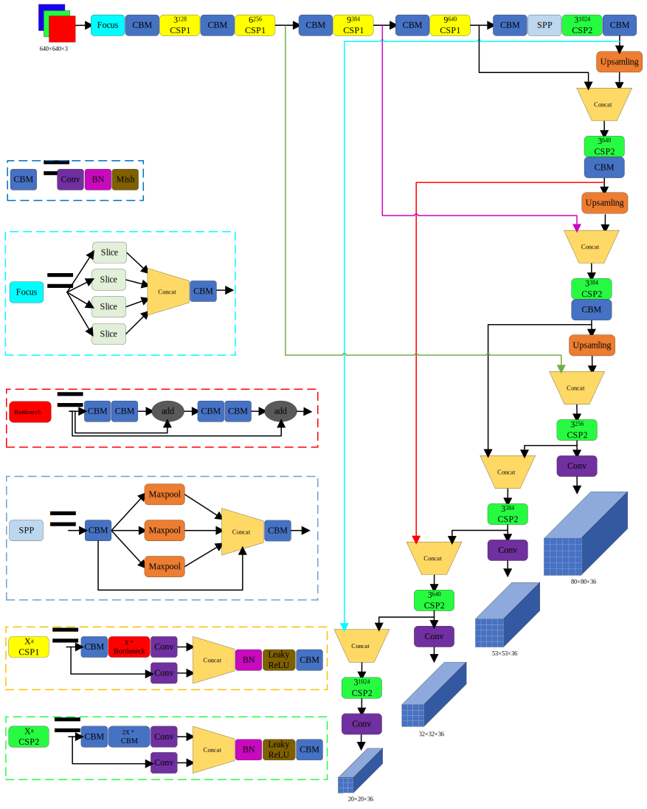
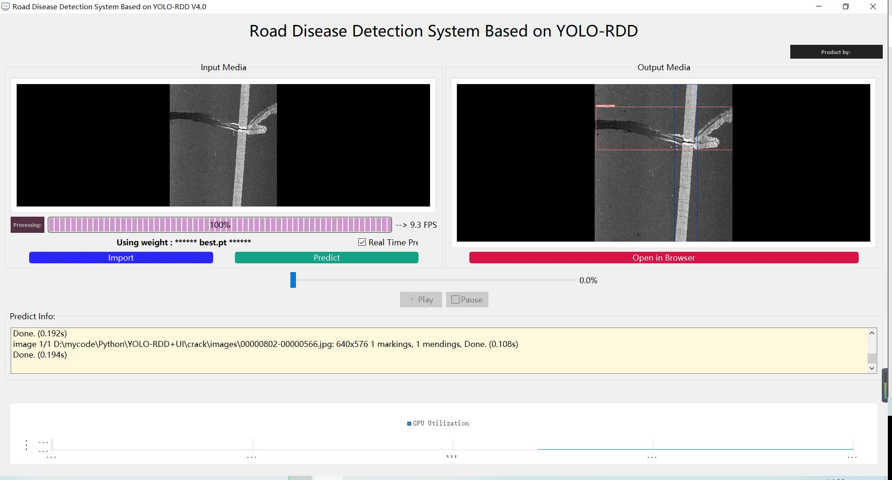
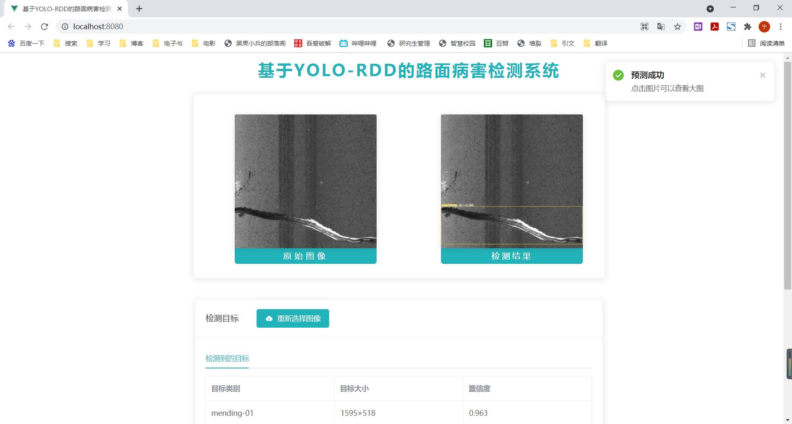

# 0.说明

本存储库是通过深度学习目标检测技术来识别路面病害类别的一个完整实现。具体的，通过改进的YOLOv5算法提升检测精度达到现有先进算法最好成绩，同时在Windows端，web端，Android端进行部署。完整的实现路面病害检测的任务。源代码将在论文接受后第一时间公布。

# 1.摘要

该代码库是    论文的源代码，

引用请使用论文


是通过对YOLOv5算法改进的**YOLO-RDD算法**实现的一个**路面病害检测系统**。在自己的数据集上取得了比第二名yolov5x算法的**MAP0.5高出5.4%**同时检测速度有略微提升。并且实现了多端的部署，其中包括在win和web端的部署，在安卓端部署正在进行中...。

本代码库的**文件结构**及其说明：

```
|-- win
    |-- data		voc数据集信息
    |-- inference	输入输出存放文件夹
    |-- models		模型模块函数
    |-- runs		训练测试结果存放文件夹
    |-- UI			UI界面
    |-- utils		模型其他函数
    |-- weights		模型权重
    |-- detect.py	模型检测函数
    |-- detect_visual.py
    |-- main.py		界面运行主函数
    |-- train.py	模型训练函数
    |-- test.py		模型测试函数
|-- web
    |-- back-end	后端
    	|-- 其他同上
    	|-- app.py	web运行主界面
    |-- front-end	前端
|-- images	readme插图
|-- requirements.txt	python环境版本
|-- readme.md	readme文档
```

# 2.论文概述

改进算法对比其他先进目标检测算法的**性能指标**如下表所示

| 算法            | 主干网络        | 输入大小 | F~1~ score | mAP@0.5   | mAP@0.5:0.95 | speed(ms) |
| --------------- | --------------- | -------- | ---------- | --------- | ------------ | --------- |
| Faster R-CNN    | Resnet101       | 1000*600 | 0.845      | 0.864     | 0.743        | 892.3     |
| SSD             | Resnet101       | 513*513  | 0.784      | 0.798     | 0.689        | 149.7     |
| RetinaNet       | C49s            | 640*640  | 0.811      | 0.829     | 0.733        | 119.8     |
| EfficientDet-D6 | Efficientnet-b6 | 640*640  | 0.847      | 0.862     | 0.76         | 155.7      |
| YOLOv5x         | CSPNet          | 640*640  | 0.854      | 0.884     | 0.802        | 39.1      |
| YOLO-RDD        | CSPNet          | 640*640  | **0.885**  | 0.931     | **0.864**    | **38.8**  |
| YOLO-RDD+TTA    | CSPNet          | 640*640  | 0.873      | **0.939** | 0.861        | 89.3      |

**注：**speed为模型检测单张图片的平均时间，为在**单个1080TI**下进行。

下图为**5种典型算法**在7种类别路面病害数据集上的**mAP0.5**的雷达图。




改进的**网络结构**如下图所示：



具体改进请参考论文。

# 3.代码运行

## 3.1 环境配置

本文网络**训练好的模型**以及训练过程可以在链接： 提取码：yolo 下载，将下载的权重best.pt放在weights文件夹下即可。数据集由于提供公司不允许开源，因此无法在此展示。后期公司同意开源将第一时间开源。

### a. win端部署

需要的软件：Pycharm、Anaconda（可选）

python环境见：requirements.txt

安装运行：

```
$ pip install -r requirements.txt
```

### b. web端部署

需要的软件：Visual Studio Code、Pycharm、Anaconda（可选）

在 VUE 前端项目下，先安装依赖：

```
npm install
```

然后运行前端：

```
npm run serve
```

python环境见requirements.txt

安装运行：

```
$ pip install -r requirements.txt
```

### c. Android端部署

待更新。。。

## 3.2  运行

配置完环境后，通过以下代码进行对数据集训练：

```
$ python train.py --data data/crack.yaml --cfg yolo-rdd.yaml --weights '' --batch-size 8
```

通过以下代码进行测试：

```
$ python test.py
```

### a. win端

可以直接使用如下代码运行，

```
$ python main.py
```

或使用如下代码编译为exe文件运行

```
$ pyinstaller -F -w main.py
```

编译为exe文件，可以直接双击运行。运行结果如下图：



### b. web端

在pycharm中运行以下代码：

```
$ python app.py
```

同时在Visual Studio Code中运行：

```
$ npm run serve
```

用浏览器打开http://localhost:8080/。运行结果如下图：



### c. Android端部署

待更新。。。

# 4.致谢

该代码库借鉴了以下开源代码库进行实现，在此表示**衷心的感谢**！！！

包括：https://github.com/ultralytics/yolov5

​			https://github.com/Sharpiless/Yolov5-Flask-VUE

​			https://github.com/PeterH0323/Smart_Construction
